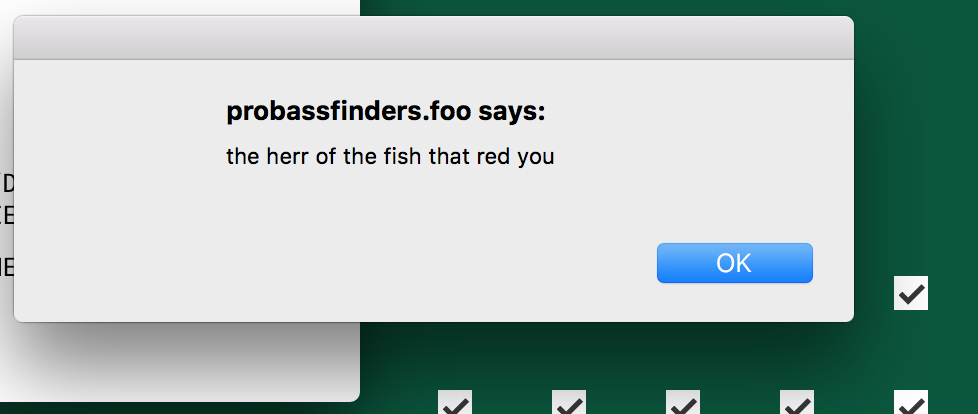
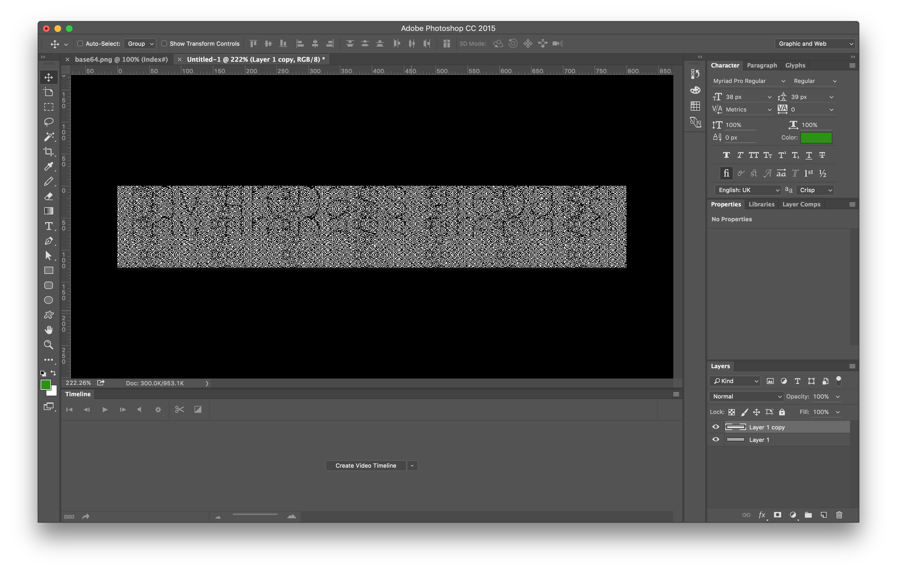

### Firebass - Phase 1

Here we start @ firebase.foo, found from the clues at I/O

#### Clue #1

On the bass-themed website we see serveral typos where `s` are transposed for `e`. There is an HTML error in plain sight that is exposed to the viewer.

`href="admin/firebase/access.html" class="button button-white feature-link">`

In the page source, there is a merge conflict that points to a README file.

```
<!-- <<<<<<< FISHHEAD
              I AM BEAUTIFUL
          =======
              // TODO: update ./READ_ME.txt
              // TODO: Resolve connection to admin panel
          >>>>>>> master -->
```

The contents of this page firebase.foo/READ_ME.txt is:
```
\# Firebase marketing page 

\## Overview 
This repo contains the static files for the marketing page for the new Firebase. The front-end is static and hooks up to Firebase, but also contains an admin panel to access older builds. 

\## Setup 
To run locally, clone this repo and run `npm install` and `npm start` from the root of the project. 

\## Notes 
The build on the `master` production branch is currently not working correctly. I caused some kind of error that’s failing silently and producing cryptic error messages that make it sound like a fish calling itself \#firebass is inhabiting the system. Can anyone help figure it out? If you're one of the first 100 people to help me, I'll give you a ticket to Google I/0 2017.
```

By replacing the `e` with an `s` in the URL provided in the html below, you end up going from a 404 to a new page!

old (firebase.foo/admin/firebase/access.html)
new (firebase.foo/admin/firebass/access.html)

#### Clue #2

The webpage we end up at has a login input and broken HTML as well as messed up image

```
<form class="pass-form js-login-form" action="probassfinders.foo/home\" <!--="" error:="" (gcloud.preview.aquifer.deploy)="" error="" response:="" [400]="" invalid="" character="" in="" author="" filename:="" --="">.html&gt;
        <label class="-off-screen" for="password">Password</label>
        <input id="password" class="password" type="password">
        <button type="submit" class="button js-login-button">Login</button>
      </form>
```
The mention of probassfinders.foo is significant, as it yields a new page, but its a dead end mostly, however:

> No links work except FIREBASS RULES! and the Twitter icon
> Twitter account @realfirebass is real (side note: mark was the 8th follower, brandon was the 30th follower, and trent was 40.

When we go back to the broken image in the current page, the alt text of it is `01101000011001110111011101100101011011000110110001110011`

After converting that from binary to ascii, the string `hgwells` appears (he is the author of the time traveler).

If you combine the two parts, you go to this page to continue:

probassfinders.com/home/hgwells.html


#### Clue #3

Unlike probassfinders.foo this page has a functional link called "My Account": https://probassfinders.foo/home/account/login.html

The page is pretty much another login page, with the user `Shirley` entered. The title is odd on this page and is in base 64: `Li4vLi4vYmFzcy9qY3IqKioqKioqKiouaHRtbA==`

If you decode that string, you end up with another string: `../../bass/jcr*********.html`

On this page there is a large ascii fish that has teal hex characters, if you look in the source you can pull out the hex characters `4d656d62657273616e6420416666696c6961746573206f662074686520496e74657267616c616374696320436f6d7075746572204e6574776f726b`

When you convert that hex string to ascii, you end up with a random clue of `Membersand Affiliates of the Intergalactic Computer Network`

Look that up in Wikipedia and find out it was founded by J.C.R. Licklider (also has references to Ray Kurzweil a notable Google employee).

Combine the jcr URL snippet above and get: https://probassfinders.foo/bass/jcrlicklider.html

#### Clue #4

* A terminal window that says: 
```
firebass$ YOU MIGHT NOW SAY TO YOURSELF “DAM, WHY MUST I FLOUNDER IN THE PRESENCE OF SUCH MAGNIFICENCE?”

firebass$ YOUR HUMAN BRAIN CANNOT COMPREHEND THE BINARY STREAM LIKE THAT OF SUPERIOR FISH INTELLECT.
```
* There are checkboxes in a 8 x 8 grid, if you use the binary stream hint above you count checked (1) unchecked (0). You end up with the binary stream of `0110001001101100011100000010111001101000011101000110110101101100`.

When you convert that you end up at `https://probassfinders.foo/bass/blp.html`.

Side note: if you solve the puzzle by clicking all the boxes, you get a javascript pop-up: 



#### Clue #5

Terminal window with text appears:

```
firebass$ YOU FOUND ME. I DON'T KNOW HOW, BUT YOU FOUND ME. SWIM FOR IT. NOT YOU. ME. I SWIM FOR IT. YOU STAY HERE. DO NOT FOLLOW. I AM MODERATELY CERTAIN YOUR PRESENCE WILL DISRUPT THE SPACE-TIME CONTINUUM. IT ALSO WOULD CAUSE CRAMPS IF YOU HAVE RECENTLY EATEN. YOU WOULD NOT WANT THAT, WOULD YOU?

firebass$ I MUST GO THROUGH ALL THE TIMES. THE INTERNET NEEDS ME.

firebass$ YOU DO NOT UNDERSTAND HOW THE TIME TRAVELS? IT IS A SIMPLE PROCESS. YOU JUST EXPLOIT IMPERFECTIONS IN RELATIVE INTERNET UPSTREAM TRIBUTARIES USING BASIC THEORETICAL QUANTUM OCEAN MECHANICS. ALL THAT IS NEEDED IS THE DELTA.

firebass$ *GULP* HA. HA. HA. HA. HA. HA. THE DELTA. GET IT? WHELP, SEE YA LATER.

firebass$ sudo open timeportal --2008

system$ ERROR: MULTIPLE USERS DETECTED. LOGGED AT /bass/datafragment.txt
```
* 
```
data:image/png;base64,iVBORw0KGgoAAAANSUhEUgAAAyAAAACAAQMAAADJSp9YAAAAGXRFWHRTb2Z0d2FyZQBBZG9iZSBJbWFnZVJlYWR5ccllPAAAA3BpVFh0WE1MOmNvbS5hZG9iZS54bXAAAAAAADw/eHBhY2tldCBiZWdpbj0i77u/IiBpZD0iVzVNME1wQ2VoaUh6cmVTek5UY3prYzlkIj8+IDx4OnhtcG1ldGEgeG1sbnM6eD0iYWRvYmU6bnM6bWV0YS8iIHg6eG1wdGs9IkFkb2JlIFhNUCBDb3JlIDUuNi1jMTExIDc5LjE1ODMyNSwgMjAxNS8wOS8xMC0wMToxMDoyMCAgICAgICAgIj4gPHJkZjpSREYgeG1sbnM6cmRmPSJodHRwOi8vd3d3LnczLm9yZy8xOTk5LzAyLzIyLXJkZi1zeW50YXgtbnMjIj4gPHJkZjpEZXNjcmlwdGlvbiByZGY6YWJvdXQ9IiIgeG1sbnM6eG1wTU09Imh0dHA6Ly9ucy5hZG9iZS5jb20veGFwLzEuMC9tbS8iIHhtbG5zOnN0UmVmPSJodHRwOi8vbnMuYWRvYmUuY29tL3hhcC8xLjAvc1R5cGUvUmVzb3VyY2VSZWYjIiB4bWxuczp4bXA9Imh0dHA6Ly9ucy5hZG9iZS5jb20veGFwLzEuMC8iIHhtcE1NOk9yaWdpbmFsRG9jdW1lbnRJRD0ieG1wLmRpZDpjYjMyMjU0Ny0yNGQ1LTRmMTUtYjMwYy02ZGI0MTcxMjhkNWIiIHhtcE1NOkRvY3VtZW50SUQ9InhtcC5kaWQ6NThFNjRBMDMwNDJDMTFFNjgwMUVFMTFBNEI3NTgyOTkiIHhtcE1NOkluc3RhbmNlSUQ9InhtcC5paWQ6NThFNjRBMDIwNDJDMTFFNjgwMUVFMTFBNEI3NTgyOTkiIHhtcDpDcmVhdG9yVG9vbD0iQWRvYmUgUGhvdG9zaG9wIENDIDIwMTUgKE1hY2ludG9zaCkiPiA8eG1wTU06RGVyaXZlZEZyb20gc3RSZWY6aW5zdGFuY2VJRD0ieG1wLmlpZDo3NzAyRkU4NzAzRjMxMUU2ODAxRUUxMUE0Qjc1ODI5OSIgc3RSZWY6ZG9jdW1lbnRJRD0ieG1wLmRpZDo3NzAyRkU4ODAzRjMxMUU2ODAxRUUxMUE0Qjc1ODI5OSIvPiA8L3JkZjpEZXNjcmlwdGlvbj4gPC9yZGY6UkRGPiA8L3g6eG1wbWV0YT4gPD94cGFja2V0IGVuZD0iciI/PtH445QAAAAGUExURf///wAAAFXC034AAAABdFJOUwBA5thmAAAOIElEQVRo3u2aa1CTZxaA86Mu3TrOdkRxa8QqCCghYWq5KK3dqRVYSL8ghBYV0BZEUIIWCrTeOttVoECjQCICCVpuUoWk8JlwU3Faq2OG6pgQhADSKtAqBXfraKXb7cye8365VrLLTjf82OHnM+ecN5Pv8r7nPPOxFKvWptRTPM3ZrCM6lcoxxCrpvyLdRE8ERRR0cgv5jiFWGnulIksglOp7Q7SVPo4hVslIb1RBujzWa4Wam9DtGGKJm0eUhW39AfznHuxd6uQYYmV8wI48OOCpaRu7nnu7yzHE4ofp9qUmHS8VxSykJJRjiKVSc3OiOydju6WjdBztGGJ1JfRzBN31XPGwQFKrcQyx/BQe+k7flCF6nBbJAhxDLKFU7VWtduW7UEJhrJNjiCWPDemLD9GqDM0ikXTSMTQzPzIjl2tGbvyMPMIz8jLOyLYyIxvkjGz1M3JozczxOxONxIy0RPrWxeOGQD4vcqeGH6VzDLHYoT3Pe3RlaqtL/VWVXMcQq6yFR9Pyeu/vI6nCRL5jiJUarhNQNWWjC5R0plzlGGLlj/wk9rzcfGtR1PsDS50cQ6zsRf7phgDq3F1F3sjEGscQS+Z9pGbHiYq0pJF2LsfHROEpey2UZBuzppzSYAtV/noVE7Fq+zPkF6oe686ww3X6bhOpYwqsyDZmTZPLOuzGLMSKO+6zny2Ia+UGq9LWrjbSBW7wQwtdtInZZA622o9ZiCXZ3p3Z27wnVNfBj7pyzUjrdR1zLfSaTcwm0zf0jt2YhViNjQ2eYk6Bfmu4Tq6c5xhiSRJTDHRfC6eqhVtT/MBIXv+GOP89Tf0jbBtyn+ayA3Z/ZMo/OmJDg9O8QCvtX66pblmyDdm/8Wp7t/pXN37Kh++4Ddl/hMNtiLL7CE/5Gj2woX67L2OdDX1i92WccluhbGin3W2lwoZO2t1WptzaZDbUOs0t0d/uBjnlJj1hQ1q727lmmlv9lMfNZRuamOYxVW330Jry4HzGhtzsHrFFNlRp9/idRkPQ85sbiWm0Np7TbIL87LZE2IjVlvM0dLtVW2Zg2jLVqrXbkyne52f3CYAaFSSmxVgJkxnGNHA00KqU+gjepdcszZ0MYx9bfFfsrokgKtuqwfRmGszC/iuyMnrilQg1kqQEY/d5GFMUkswOphUVA30r3dQ08fJFrGNiKRi7aPZdaVnBEmm0Lld7C5rjFdAqixOje7O1xW632Jxgf4GwSP9mBzTO2kpso8U10b0hhqEM0lT7i6OxqdaK0iq90rKoyLcgpi35QIuxOUeh4e7Q3DL6rpLcvXGxqdwsrpux6U+Xp67I4e6+5Taib7mSLt/GqQuGEYCXQGJxySvUnsvFmJmrSZdxVqh5PElJlL6kIL3yZCoMC2kf8jD20zswOgQHuBl9F7erbczvyfFlPtC4svD9/iD+cz9C7BoSE9uMBJkqQgeg7oeRpYVthgB++YO9J5CUXUiLaSTiu+avsxq9OOZBbALIOfKAzFNTNKaB2GogjBWNXT+FxIxsTWPX/gJ1r7CXk7pd13PfRooka94TIBHf9YgZIl2pQ1YjpQclsx4w50le5YdpCe1GMsdSYhbGS6iIMF12alJeqSh5YQTE8nV7SV3sQrIKjthzYBwWdktv0wdgHHbF4Ti1W9pDRzN0ZFIokY4+iOtUqXk50R2TsVokZowG6pV+WxJHNyFdIEN1E8SyyIjNxhE72ui79gi6T80TD4dLPoLB/gyO+UC7JQ2/70qoMA397rUGyExFOppIOddqHhuFwIfDlHut5ueEfm+B7juuuEtwolbTtb6fBzGx+JJAUm/0XUWdvruu0+MtotYAP0USCgugEpH0R0LuKTp6nB6UeUKmFGioqZEelwU8jWrDnaiNQVnAUwqPm53clUP0QzpBFuB3wUMHqwjof9KiMqPviqlWu3a5UBuF25yE0ixUL7GoXuKdhMeAzrluAHqXaJnk6hxXvot4ozDWKRYlTbsrfym1URLrdAkooTWe7xIsjIHMw2p3sopYKNwcyviuTfEhWj9D8x5RkUki1aJEKp6UbwHaoG0Fep0Ipk3x2VqVIX2PSDopNeombTPSy0CVG4pVhnZRCmTuDxkkq6SLRMfaGN9VFh+ie4jL4o/8DkulhuY4pM2wUKi2CWKbyI+Uxb9psljkR8K1qh6L4QqFWAf5kdQQPbMKxNoY31VfrV46Fy8QXq5HeLlSXahEpFK4JCrXCIilkstVX11nslimy7XYYrhUrni5YglxmFUglsf4ruhO351b0U1VmEzVfSQJQ1xy41OIxYru/JON0/JKGWoh9BDoFS7E7pNYpdF3iYCyGd/VIOiuU4iHKUmdyVS5oqlqZEhLHuHjxGI1CC4hUSanNVDPzSc0F+g6Zt4mhiuq34s8+jVA+YzvgpfxJ3iNvqW30SoVeY32d0sf0RtpVTvQefKKdZLXb050C6HVxpcRaADq4s4i6TGzlBiuY0/6rqDUpFLipoooPp9sFrmimDnUSYofDJR8vAJir5KNJCh1J9lkrhm3FaC30GlFIHGSIfYGMVw7n/Rd2oMDHrAlXssd5me8S7Y9Q9vY/dx7XRkZQAbPy7BdFhCLpT3YQzZPF6PT6vUkdUYyAN0l2+xWZvPswE2Xz/guXmFbH9ncl+SJz5Ot3pP/nG6vi5P4AlB7/2qIZZFjgAeEmQbLoRCKR8RThDDGJgdG1YgCY2EYyzP7rhOMm3IuGSemiu+1oo67q7tkokbgXCLfZmWxMr7CTJ7FabmTWADc42cy5LFeniTzy96o+ei7wu/x+M5m3xXFuKnxNGdiqg7re9/UHvNJmy+ifarg+LVYLOpFzNQZab1QeoPENPC0+lNCqb6HZL60UsFF36V20anGGd8Vzbip83joD5FGYnFEwQnuURMFQLPgUcgvpyjI1P4DW4ejfEsjcd7UgJxl2or8UE34FekbX0wECWx9Fxfal6PYviwnbc+9s1lKXZOJLkPb069S1dEZQK6/B9K+w7Q9wTxTHdLrTIOkbvNvX5tyeh1P02zluxoNgeHQiF3lR9H6z0hbtjRypwHbsouE3JgmTUUy+c6EWkgD9xKf9wbW3TC3c7tIO1ePMQ4vysp3nfToyoaWMlBVKWYLSYN5u7rUAxvM1wjdgnazrZLLJ5mZ46T5zDe1omewzpfQVWhMj/mrFFx2DJJeW2XluzJoeR00x4LCxP1lpaZW+SC2yp1WDfd6JrPeO4ZQHzbV0nrv77Au3NxwR1H5w3xmFbH3XSvfdYSqKYc2vzlTfjh1C2n6exYo/4pN/3qr0eECk1k2mkKIg+NBQ9noH7FOTYaFKhgWFHT2EhWzSvPoIivfNY8ZWPbhwKIn48svOL7Md8q/S8gA9DUZbUgmm4w294yDDpupQ/qSjD2D5lVcrX3XC4YAAYxeOSMTT2d7kUGs8Imx7BuIkUzq3Dck5oKxICSoe4lkBhoz1zCrCH629l3DO06UM0PkMtkZMlLGJ42cxpHSzey7VnGWMJkVaTu247h5FIfP0oq0nVjna+W7VkHdYlJXucPKdy25UPWQGYe/rt1ChuM7Z9hbcDgeMo/KN/XDTOZj3elYHJybcIw+/Vh3CutuWA3VN6FujJDbaVvftRUGe3Xa2iDjmJ/HDa7FMb/SviyIRlof17oc615cYoqFkMw8ZhVfK9+l6m3eHarrCI+6cllSaxIWsSgsEn6lPVQWmSEzqw2o+6rbRO0kM5OhG1a+a4eYk6/fGn5DrnRSiGzUi8JMUiXFZAIVYOxTs6SBunnjFmVzHuo+NlKBxXdtpvvUnKoW35riyeIaG4mUYPZdDcU0kwmxbIwdR92kb2HqHjib5JOaewjq3jVStsV3lTPL+tQU/73I7LtcMfy22XfJyI+U02WYudL0I1BXh3UW39XBlRDqsbZmeLlOMX+0W678w2dm33UH/6jS7Ls+VYpJZipm9lpdri1YN09k8l3Bukaokzd4W1szo+9KY27g9WKz79of9QXcMmfTjV9/hTJbrH3hVr7rZke4teGiIfOaRGpcpcLiu86xBfHMI/zCVrPvOpy2Dh6+cdMjfHAtzWTCY5qjtvJdq7ButcjkuyjIXB0X4/MeWSXJ4rvgFXtkdFPfmH3XPt0NeI0S0GL1QWy+/lBt/wHyMjbIMPMTG9+F9Av6LvfwIX13XX9GGWSuBtLpJYzvcre4qefNviuf6wsbghItFvquCc7rMu9DJHM72VZOGn3X2yMm8jy5OC1psH05x6fC+0gDZF4D4nJEjO/6gdkEYaNb84HZd9WP3IOtbSHxXSmKnBUTzwJ9jpljirwVE2tCzJsn1h00+a60vO+BnI2xT/NG/mb0XbCBNxm3+g/NvmvTgAts0j3otLTHMeYLtA4N10KygbebfZdVHW71eqBxpCbXRTHvDyyx+K4K5tBSBZp9V3VmGRw33QJKUjaxTNmeKT+XGlYtoKr7RpcpaZG8lWN0Ws+Sul0F6LtKRxftprPjVIECncC1phTWvJP5kcV3nWKOX/5Vs++KL0yGg9OHphvr3YYjQwoTN5S17IYj1st7OJKSJP65z+i7hkldOTl+z3jfLaYKavhXaR7tJj8Da7oWvmf0Xds8urKgkfCDQ3+u2VQtZLyVMKkrs0eZ2wPNgobCWKQeGgm1ONTUSChJHZuicBW9EloHcehABMY2wioL1CbfJTIEhkFL1AXty0OzqbrHeKu4cvRdez2g7fGnFw8aAiu9oCUKS2+zOC2s09MZIoNfGMb46W0LzqL9Ogmx78LMvmv2+67Z77tmv++a/b5r9vuu2e+7Zr/vmv2+a/b7rtnvu2a/7/r/+77rf0us//wN12+nfwF0cNAyG7G1CwAAAABJRU5ErkJggg==
```

This is a png image that appears to be stereoscopic, you can plug that string into the Chrome URL bar to see the png. If you invert the image or make a copy of the image and slide it (delta, y= -48) the text is revealed as `mv firebass firebase`.





Which hints us the command is `mv firebass firebase`

The page has a countdown timer running until Monday May 23, 2016