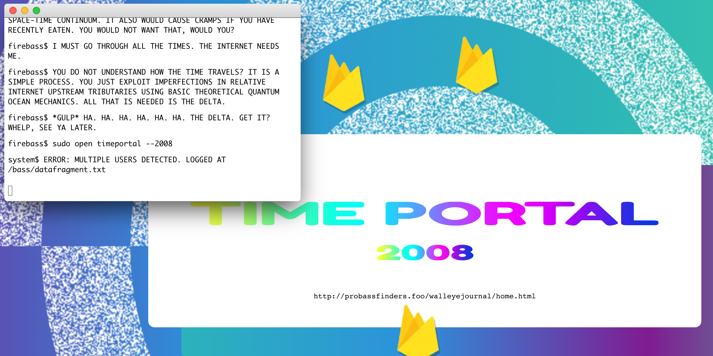
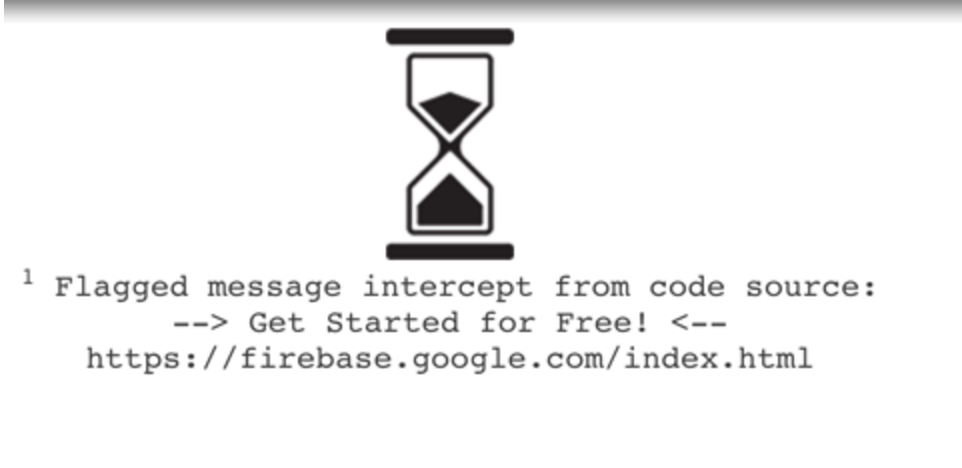
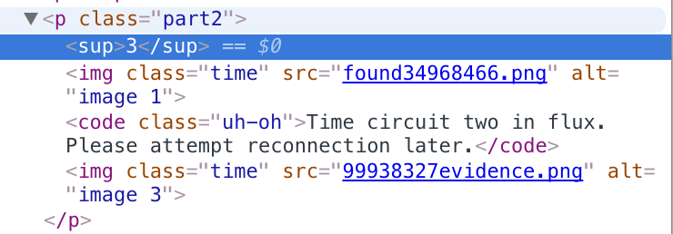
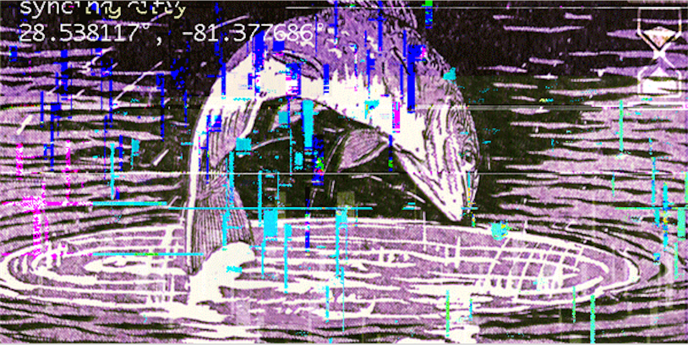

### Firebass - Phase 2

Once the time locks were disengaged on Sunday evening (22nd May 2016), coming back to the screen we were last on (https://probassfinders.foo/bass/blp.html) finally reveals the portal to 2008 along with a link:

Following through with the link takes us to a new section:

https://probassfinders.foo/walleyejournal/home.html

Time to search for clues which appear to be marked using `` elements. 

#### Clue #1

If you click logout you go to:

https://probassfinders.foo/walleyejournal/search.html

Here we can find:

The message basically spells that you need to go to the real Firebase page and search in the source for "Get Started for Free" and you will find the following HTML comment:

    Get Started for Free
      
    <!--
          \ |   \       |
    - o     o   - o   - o
        \
    -->
    
Is that a chemical element? No! Is it a clock? No! Is it a signal? Yes - the FLAGGED kind!

That spells STOP and we have *clue #1*

#### Clue #2

If you click SUBSCRIBE that takes you to:

https://probassfinders.foo/walleyejournal/newsletter.html?

At the bottom there will be a link to the message archive:

https://probassfinders.foo/walleyejournal/messages/time-security-alert.html

Clicking the rows under SENDER allows you to navigate through the messages and if you go to the _Open Immediately_ one you will find `SW50cnVkZXI=` at the end.

Decoding the base64 reveals *clue #2*:

    >>> import base64
    >>> base64.b64decode("SW50cnVkZXI=")
    'Intruder'

There is another hint in the message archive - the top message contains some Morse code:

.--. ..- - .-.-.-

.. - .-.-.-

.- .-.. .-.. .-.-.-

- --- --. . - .... . .-. .-.-.-

That spells PUT. IT. ALL. TOGETHER. 

#### Clue #3

If you click Featured Bass you will see a page that appears to have a time-locked piece and two images with a 404 due to erroneus (?) URL:

Notice how the class is `time`, perhaps the `[0-9]+` part of the image filename is a timestamp. Adding them gives `134906793` which converts to 04/11/1974 @ 10:06am (UTC).

One of the top results after googling for `found evidence 1974` is *Lucy* the australopithecus.

#### Clue 4

The image at the top of the article on the homepage is actually a GIF:

Let's look at the interesting frame:

Those coordinates are nearby Downtown *Orlando* City Hall.

The `syncing city` bit also makes us want to set our timezone to East Cost when we wait for the next time lock. If the challenge for phase 2 started at midnight - that means this guy did it in 15 mins?! https://twitter.com/lernerbrandon/status/734583494018539520

### PIAT - Putting It All Together

So we have:

1. STOP

2. Intruder

3. Lucy

4. Orlando

The place where we found the Morse code earlier in clue #2 also included instructions for accessing `walleyejournal/[1][2][3][4].HTML` which finally takes us to:

https://probassfinders.foo/walleyejournal/SILO.html

That also gives us a link to a key `logs/fragmentkey.txt` (once the terminal bass is done talking) which is a PNG. It's interesting that it's called a `key` because overlaying that over the image we got from the phase 1 timelock terminal yields the command to undo all of this fishy madness `mv firebass firebase`. But we already we knew that's what the `datafragment` in phase 1 means, by overlaying a copy of itself and shifting a little, we didn't really need to wait for `logs/fragmentkey.txt` to get a key. So...*what the fragment?*

Time lock time. See you in 1997.
