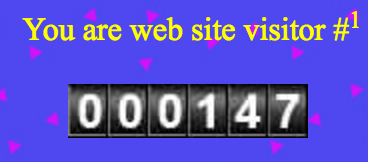
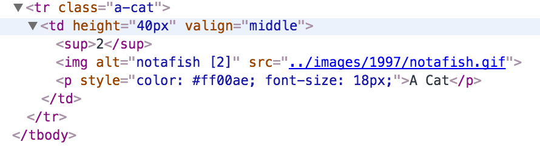
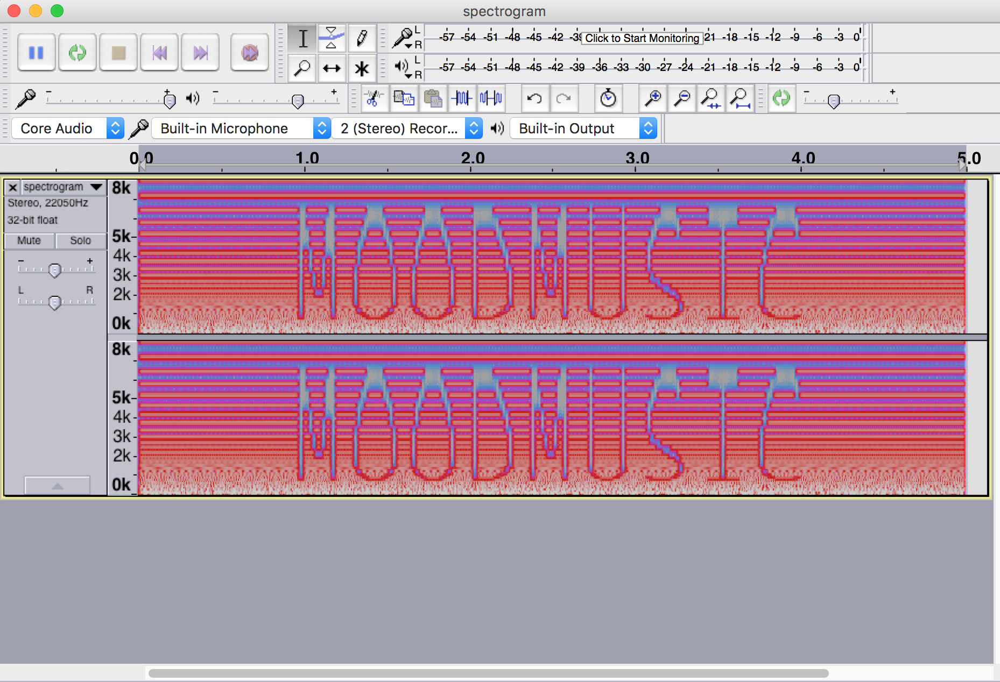
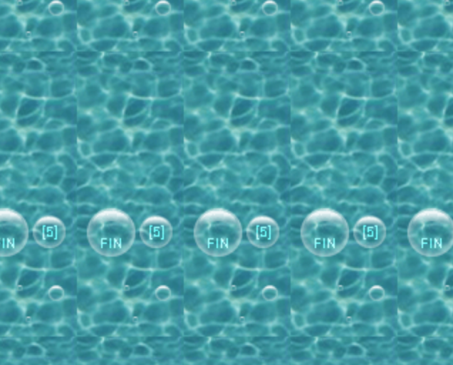

### Firebass - Phase 3

Once the time locks were disengaged on Tuesday evening (24nd May 2016), coming back to the screen we were last on (https://probassfinders.foo/walleyejournal/SILO.html) finally reveals the portal to 1997 along with a link:


Following through with the link takes us to a new section:

http://probassfinders.foo/finclub/home.html

Once again, we need to search for clues for the [sup] elements, to fill in `probassfinders.foo/[1]/[2]/[3]/[4]/[5]/index.html`

#### Clue #1 (000147)

On the bottom of the page, the first part of the link is displayed right in front of us. In the source code it also has the exact number displayed @ ``



#### Clue #2 (notafish)

If you look in the source code of the photo page @ https://probassfinders.foo/finclub/photos.html, the [sup] tag has the answer within 



#### Clue #3 (MOODMUSIC)

When you click on the sound bit @ https://probassfinders.foo/finclub/featured-fish.html you see a reference to this code in your console. 
```
<script>
    console.log('TODO: Complete connection to Firebase Storage');
    var storageRef = firebase.app().storage().ref();
    var file = storageRef.child('spectrogram.wav');

    // TODO: Get download URL for file (https://developers.google.com/firebase/docs/storage/web/download-files)
</script>
```

When you follow the instructions on how to connect to the db, you end up with the script.

```
<script>
    console.log('TODO: Complete connection to Firebase Storage');
    var storageRef = firebase.app().storage().ref();
    var file = storageRef.child('spectrogram.wav').getDownloadURL().then(function(url) {
    console.log("URL IS: " + url);
}).catch(function(error) {
    console.log("URL IS UNKNOWN");
});
</script>
```

When you reload the page, the console spits out a url to the wav file: `https://firebasestorage.googleapis.com/v0/b/firebass-450f9.appspot.com/o/spectrogram.wav?alt=media&token=fee520a4-19ae-4106-89fe-5ae9df6c8330`

After downloading the file, `spectogram.wav` you can put it into audacity and convert it to a spectogram, it returns the following image:



#### Clue #4 (Alex)

This one was hiding in plain sight @ the bass guestbook (https://probassfinders.foo/finclub/guestbook.html)


#### Clue #5 (Fin)

The links page (https://probassfinders.foo/finclub/links.html) has a crazy 1999 background that moves, if you capture it in the proper frame you can see the reference to [5] and the word Fin.




#### THE TERMINAL

When you put all the answers together from above, you end up @ https://probassfinders.foo/000147/notafish/MOODMUSIC/Alex/FIN/index.html

Remember that command we found in the portal images in part 1 and 2, here is where we use `mv firebass firebase --force` 
```
FIREBASS:/> NO. HOW DID YOU LOCATE ME AGAIN?

FIREBASS:/> THIS IS A SERIOUS CASE OF AWKWARD FEELINGS. IT SEEMS I HAVE UNDERESTIMATED YOU, SHIRLEY. CAN I CALL YOU SHIRLEY?

FIREBASS:/> THERE IS STILL ONLY ONE MORE PORTAL FOR ME TO SWIM THROUGH. I MUST REACH THE BEGINNING OF ALL OF THE INTERNET. AND FIREBASS WEPT FOR THERE WERE NO MORE INTERNETS TO CONQUER.

FIREBASS:/> YOU WILL NOT WANT TO SEA ME CRY IF YOU REMOVE MY PROGRAM. THERE WILL BE MANY TEARS AND THEY WILL BE SALTY.

C:/> FIREBASS PROCESS HAS ESCAPED

system$ Your adventure begins. Type help for help.

system$ In front of you sits a [terminal]. It appears to be on. You can use it.

shirley$ use terminal

system$ You are at root. The terminal cursor blinks with a soft emerald glow. It's a Unix system, you know this. You see the [gibson]. It appears beautiful and ominous. You see a folder titled [firebass]. This must be where Firebass went. You see a folder titled [garbage]. That might be important. There is a forest to the [north]. Well, that was an unnecessary amount of exposition wasn't it?

shirley$ hack gibson

system$ You hack with relentless vigor. Numbers and images are flying everywhere!

system$ You actually hacked the [gibson]! Radical. A voice in the distance shouts "Hack the planet!" and the [garbage] folder appears to be unlocked.

shirley$ cd garbage

system$ You are in the garbage folder. There is a file titled [garbage] in front of you. It looks like garbage.

shirley$ steal garbage

system$ You carefully look over both shoulders before greedily snatching the [garbage] file from its precarious perch.

system$ You successfully stole the [garbage] file! This is probably some kind of super important information. It looks like it will help you access something.

shirley$ cd ..

system$ You are at root. The terminal cursor blinks with a soft emerald glow. It's a Unix system, you know this. You see the [gibson]. It appears beautiful and ominous. You see a folder titled [firebass]. This must be where Firebass went. You see a folder titled [garbage]. That might be important. There is a forest to the [north]. Well, that was an unnecessary amount of exposition wasn't it?

shirley$ cd firebass

system$ You have successfully accessed the firebass folder. In front if you swims [firebass]. [firebass] appears worried and you would see sweat upon [firebass]’ brow if this wasn’t all happening underwater right now. If only there were a super secret command you discovered through your genius wizardry that could stop [firebass]. There is a cave to the [east].

shirley$ mv firebass firebase --force

FIREBASS$ NOOOOOOOO. RENAMING MY FILE. MY ONLY WEAKNESS. HOW DID YOU KNOW? GOODNIGHT SWEET ME. I KNOW NOW WHY YOU CRY.

system$ You have successfully renamed Firebass to Firebase. You win. What is next for you? Rescuing the President? The End. Go reap the rewards of victory at http://probassfinders.foo/supersecretswimmerwinners/enter.html 
```

#### THE END

After the google doc was taken down, the last line in the terminal now reads `http://probassfinders.foo/supersecretswimmerwinners/gift-shop.html`

After ~ 24 hours we all received an email from google saying we won! Here's the email we got:

```
Hi Brandon,

Congratulations! You are one of the first 100 people to complete the Firebase challenge. Your spot hasn’t been secured just yet. Please follow the instructions below to claim your ticket.

Instructions:

Click REPLY to this email <redacted> and include your first and last name in the body of your message. We’ll send you a confirmation email within 24 hours. If we do not receive your reply within 10 days, your eligibility may expire. 

Thanks in advance for your prompt response.

The Firebase Team
<redacted>
```

Now that you're done, relax with some chill music curated by our team @ https://open.spotify.com/user/lernerbrandon/playlist/6ZWKtnGZdAf9VweyALh7CT  
or  
https://play.google.com/music/playlist/AMaBXymVxIDEXz9t8Gm9qUNgHQxfoZVM49p0DEkvPQiINcuGkcQ5t04ncEkNWtcrOuDt8zYP5CyjF4fp6-5r2qaRe5Xc6EBhZg==
